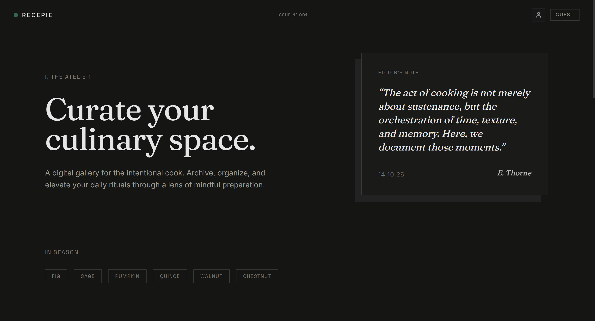
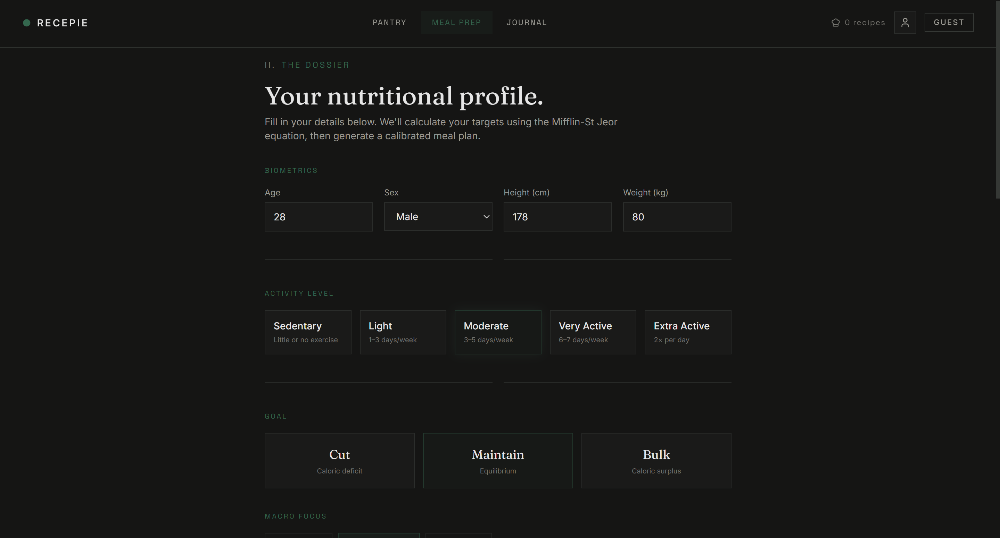
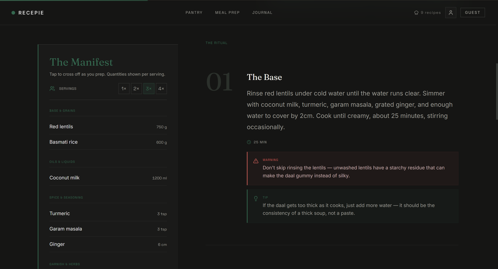
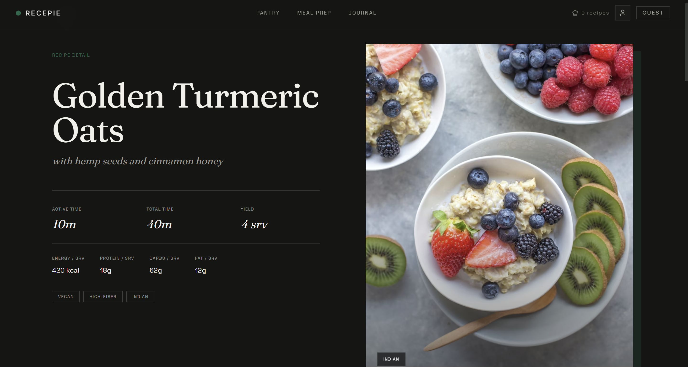
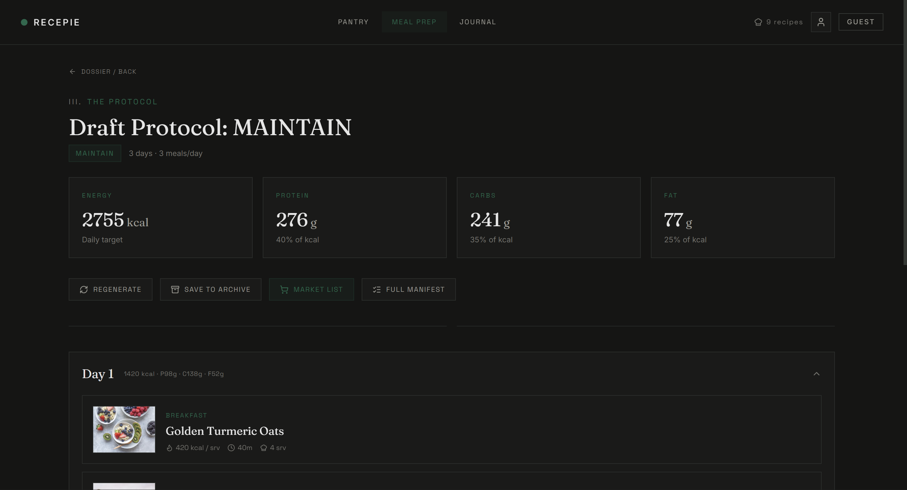
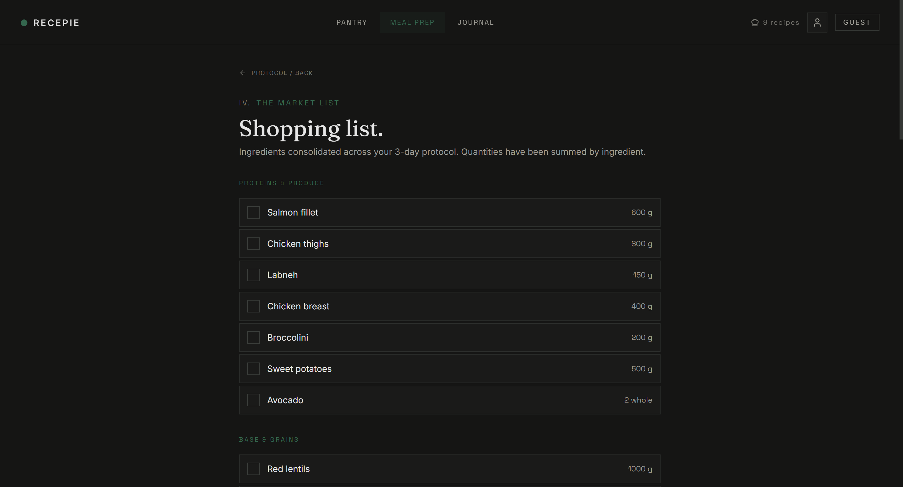

# RECEPIE — Intelligent Meal Design

> A dark-mode culinary atelier for home cooks. Generate AI-powered meal plans, match pantry ingredients to recipes, and master your nutrition.

**🔗 Live demo:** [recepie-app-gilt.vercel.app](https://recepie-app-gilt.vercel.app)

[](https://nextjs.org/)
[](https://typescriptlang.org/)
[](https://tailwindcss.com/)
[](https://ai.google.dev/)
[](https://supabase.com/)

## Preview



| Preferences | Plan Instructions | Recipe Instructions |
|-------------|-------------------|---------------------|
|  |  |  |

| Generated Protocol | Shopping List |
|--------------------|---------------|
|  |  |

---

## Features

- **AI Meal Plan Generation** — Produces structured, multi-day meal protocols using the Gemini API with enforced JSON schemas for type-safe responses
- **TDEE & Macro Calculator** — Mifflin-St Jeor equation with configurable activity levels, goals (cut / maintain / bulk), and macro splits
- **Pantry Matching** — Cross-references your inventory against recipe ingredient lists to surface what you can cook now
- **Market List** — Auto-aggregates and consolidates ingredients across all plan days, grouped by section
- **Budget Constraints** — Optional weekly allocation range that guides the AI to stay within your grocery budget
- **Preparation Cadence** — Choose between maximum variety, 4/3 batch-cooking splits, or full uniformity
- **Beginner-Friendly Guidance** — Every recipe step includes contextual warnings, tips, and optional upgrades

## Tech Stack

| Layer | Technology |
|---|---|
| Framework | Next.js 16 (App Router, Turbopack) |
| Language | TypeScript 5 |
| Styling | Tailwind CSS v4, custom design token system |
| AI | Google Gemini API (structured JSON output) |
| Database | Supabase (PostgreSQL, guest-mode persistence) |
| Animation | Framer Motion (shared-element transitions, reduced-motion support) |
| Validation | Zod (API request schemas) |
| Icons | Lucide React |
| Typography | Inter, Space Grotesk, Fraunces (via `next/font`) |

## Architecture

```
app/
├── (app)/              # Authenticated layout group (nav + footer)
│   ├── journal/        # Kitchen notes (coming soon)
│   ├── meal-prep/
│   │   ├── archive/    # Plan history with Supabase persistence
│   │   ├── dossier/    # User profile form → macro calculation
│   │   ├── market-list/# Consolidated shopping list
│   │   └── protocol/   # Generated meal plan display
│   ├── pantry/         # Ingredient inventory + recipe matching
│   └── recipe/[id]/    # Individual recipe detail view
├── api/
│   └── generate-plan/  # POST endpoint → Gemini AI → structured MealPlan
└── page.tsx            # Marketing landing page

lib/
├── gemini.ts           # AI client, schema definition, prompt builder
├── images.ts           # Unsplash image resolution (curated + keyword-based)
├── motion.ts           # Framer Motion constants and reusable variants
├── nutrition/tdee.ts   # TDEE calculator (Mifflin-St Jeor)
├── plans.ts            # Supabase CRUD for meal plans
├── supabase.ts         # Supabase client singleton
└── mocks/data.ts       # Fallback mock data for offline/demo use

components/
├── nav/                # HomeNav, AppNav
├── footer/             # MarketingFooter, AppFooter
└── shared/             # Reusable UI primitives (Cards, Kicker, etc.)
```

## Getting Started

### Prerequisites

- Node.js 18+
- [pnpm](https://pnpm.io/) (recommended) or npm

### Setup

```bash
# Clone the repository
git clone https://github.com/Manpreet445/recepie.git
cd recepie

# Install dependencies
pnpm install

# Configure environment variables
cp .env.example .env.local
# Then edit .env.local with your actual keys (see table below)

# Start the development server
pnpm dev
```

Open [http://localhost:3000](http://localhost:3000) to view the app.

### Environment Variables

| Variable | Required | Description |
|---|---|---|
| `GEMINI_API_KEY` | Yes | Google Gemini API key ([get one here](https://aistudio.google.com/apikey)) |
| `GEMINI_MODEL` | No | Model identifier (defaults to `gemini-flash-latest`) |
| `NEXT_PUBLIC_SUPABASE_URL` | Yes | Supabase project URL |
| `NEXT_PUBLIC_SUPABASE_ANON_KEY` | Yes | Supabase anonymous/public key |
| `SUPABASE_SERVICE_ROLE_KEY` | No | Supabase service role key (server-side only) |

## Scripts

| Command | Description |
|---|---|
| `pnpm dev` | Start dev server with Turbopack |
| `pnpm build` | Production build |
| `pnpm start` | Start production server |
| `pnpm lint` | Run ESLint |
| `pnpm test` | Run Vitest test suite |

## Scripts
[your scripts table]

## Roadmap
- [x] AI meal plan generation (Gemini structured output)
- [x] TDEE & macro calculator
- [x] Multi-day plan with budget + cadence constraints
- [x] Auto-aggregated shopping list
- [ ] Supabase persistence for plan history
- [ ] Pantry-to-recipe matching (in progress)
- [ ] Kitchen journal & recipe notes
- [ ] Recipe rating + favorites
- [ ] Mobile-optimized layout pass

## License

© 2026. All Rights Reserved.

This repository is public for portfolio demonstration purposes only. It is not licensed for use, modification, or redistribution by third parties.
